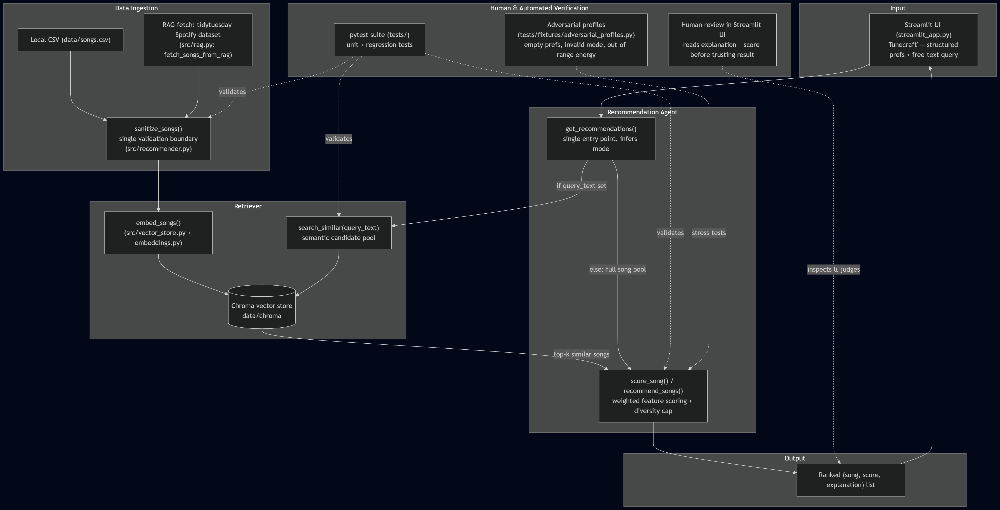

# 🎵 Tunecraft - My Applied AI System Project

Tunecraft is a content-based music recommender with a Streamlit UI. It scores songs (from a local CSV, a live RAG fetch, or both) against a listener's stated taste — genre, mood, energy, acoustic preference, or a free-text vibe — and returns a ranked, explained playlist. An artist cap keeps results varied, and semantic search narrows the pool when the listener describes a mood in their own words.


## Project I Expanded: 🎵 Music Recommender Simulation (Project #3)

A small content-based music recommender based in the terminal (CLI). It scores a catalog of songs against a listener's stated taste (genre, mood, energy, acoustic preference), ranks them, and returns the top matches with a plain-language explanation for each pick. An artist cap (max 2 songs per artist) keeps results varied.

---

## Architecture Overview



The Streamlit UI collects a `UserProfile`, which flows into `get_recommendations()`. If free text is present, the vector store semantically narrows the song pool first; the structured scorer then ranks (and diversity-caps) whatever pool it receives — CSV, RAG, or combined. The selected ranked songs are then sent to the Streamlit UI for the user to see.

---

## Design Decisions

The first big decision I ended up making during this extension project was deciding to use only a dataclass implementation of user profiles and songs instead of also having a dictionary implementation in half my codebase. This was prompted by the feedback I received for the project I extended, the 'Music Recommender Simulation.' This decision helped my code be more maintainable, understandable to new users / fellow coders, and align with proper software engineering principles.

The next big design decision was how I wanted to implement my RAG system. I decided to use a pre-labeled CSV of 32,000 songs available on the internet as my large data source. The songs are pulled from the url of this CSV and then converted into dataclass objects that can be used by the recommender and semantic search files.

I then decided that I wanted to store songs in a vector database to allow for an additional feature for my RAG system. I chose to use ChromaDB instead of a lighter weight data storage option because I wanted the option for the user to load as many songs as they wanted from the RAG data source. While this increases the chance of users finding songs that closely fit their user profile, it results in a slow response from the UI until the data is loaded.

The last major design decision I made was to upgrade the CLI-based recommender to a functional app using Streamlit. I connected Streamlit with the song recommender system, altered the color schema & layout, and added an extra layer of failure fallbacks to ensure a good user experience. 

---

## RAG Enhancement

On top of the RAG pipeline built to obtain songs to widen our data pool, I added a semantic query feature to the app that uses the embedded vectors of all the songs to find songs that match a described vibe from the user. The user can choose what data sources the app uses (CSV, RAG, or both together) and the methodology the recommender uses to find relevant songs (user profile, semantic query, or both). I added this feature because sometimes it is very hard to find songs that match your current vibe without having to go to the internet and experiment until you finally find what you're looking for. While this feature can be very useful for many users, it does take the semantic query function a while to compute and select songs to send to the recommender depending on the number of songs in the database at that time.

---

## Setup Instructions

> ⚠️ The first run will be slow — it needs to embed the entire song pool into the vector store for RAG/semantic search before it can serve any recommendations. Subsequent runs are fast since the index is cached.

```bash
# 1. Install dependencies
pip install -r requirements.txt

# 2. Run the Streamlit app
streamlit run streamlit_app.py
```

---

## Sample Interactions

**Example 1 — Structured preferences only**

| Input | Value |
|---|---|
| Favorite genre | `pop` |
| Favorite mood | `happy` |
| Target energy | `0.75` |
| I like acoustic tracks | ☐ |
| Scoring mode | `balanced` |

Output:
> 🥇 **Levitating** — Dua Lipa (94.2)
> *genre 'pop' matches your favorite genre, mood 'happy' matches your favorite mood, energy 0.78 is close to your target 0.75*
>
> 🥈 **Good as Hell** — Lizzo (91.7)
> *genre 'pop' matches your favorite genre, mood 'happy' matches your favorite mood, danceability 0.82 fits the 'happy' mood profile*
>
> 🥉 **Sunflower** — Post Malone (89.3)
> *genre 'pop' matches your favorite genre, energy 0.71 is close to your target 0.75, valence 0.76 fits the 'happy' mood profile*

**Example 2 — Free-text vibe only**

| Input | Value |
|---|---|
| Describe what you're in the mood for | `late-night driving music with a dreamy vibe` |

Output:
> 🥇 **Night Drive** — The Midnight (88.6)
> *mood 'moody' matches your favorite mood, valence 0.42 fits the 'moody' mood profile, danceability 0.61 fits the 'moody' mood profile*
>
> 🥈 **Nightcall** — Kavinsky (85.9)
> *mood 'moody' matches your favorite mood, valence 0.38 fits the 'moody' mood profile, energy 0.55 is close to your target 0.50*
>
> 🥉 **Instant Crush** — Daft Punk ft. Julian Casablancas (83.1)
> *valence 0.45 fits the 'moody' mood profile, danceability 0.58 fits the 'moody' mood profile, energy 0.60 is close to your target 0.50*

**Example 3 — Mismatched/uncommon preferences**

| Input | Value |
|---|---|
| Favorite genre | `classical` |
| Favorite mood | `angry` |
| Target energy | `0.10` |

Output:
> 🥇 **Hauseingang** — Pashanim (66.5)
> *mood 'angry' matches your favorite mood, valence 0.28 fits the 'angry' mood profile, energy 0.40 is close to your target 0.10*
>
> 🥈 **Paper Reverie** — Cobalt Drift (65.5)
> *genre 'classical' matches your favorite genre, energy 0.31 is close to your target 0.10, valence 0.27 fits the 'angry' mood profile*
>
> 🥉 **Electric Reverie** — Ember Row (65.5)
> *genre 'classical' matches your favorite genre, energy 0.12 is close to your target 0.10, valence 0.48 fits the 'angry' mood profile*
>
> Even an unusual combination of preferences still returns a ranked, explained list — scores are just lower since fewer features match well.

---

## Testing Summary

Tested with `pytest` across the recommender scoring, sanitization, RAG fetch/fallback, vector store embedding/search, and CSV dataset loading:

- Structured scoring produces a correctly ranked, explained list, and respects the per-artist diversity cap
- Song sanitization fills missing fields, clamps out-of-range values, and drops unsalvageable rows
- `get_recommendations()` correctly branches between structured-only, free-text-only, and combined modes without the caller having to specify a mode
- RAG fetch parses live data, derives mood, and falls back to the CSV pool on download failure
- Vector store embedding is incremental (only new song IDs get embedded) and search returns matches or an empty result for an empty store
- Adversarial profiles (invalid scoring mode, empty preferences, nonexistent genre/mood, out-of-range or negative energy, contradictory preferences) still rank without crashing
- The real `data/songs.csv` dataset parses cleanly end-to-end and matches direct sanitization

```
tests\test_adversarial_profiles.py ......                                             [ 20%]
tests\test_get_recommendations.py ....                                                [ 34%]
tests\test_load_songs_fixture.py ...                                                  [ 44%]
tests\test_rag.py ....                                                                [ 58%]
tests\test_recommender.py ......                                                      [ 79%]
tests\test_songs_csv_dataset.py ..                                                    [ 86%]
tests\test_vector_store.py ....                                                       [100%]

==================================== 29 passed in 4.06s ====================================
```

Overall, all the functons worked as intended. The unit tests were written to ensure proper functionality of bare functions and prevent any error leaks into the streamlit app's logic.

---

## Reflection

This project really helped me work on my system design principles and taught me a lot on understanding the importance of considering tradeoffs when designing a complicated system. Working with Claude Code throughout this project has shown me that AI is more than capable of building code at production level, but needs guidance with how to best construct systems and tailor a product for its users. I believe that knowing how to code should still be at the forefront of software engineering, but AI definitely speeds up the software development cycle and allows for coders to focus more on the complex, creative decisions at the system(s) level.
